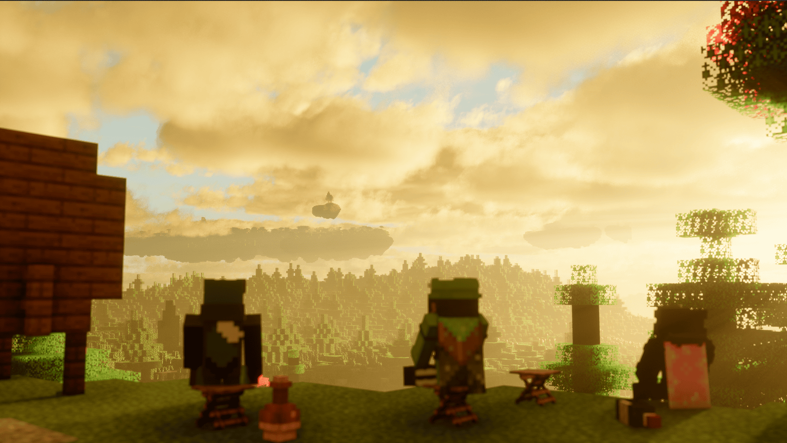

# 酿酒

## 饮酒

饮酒后，你的醉酒度会上升，并可能出现以下情形：

- 无法正常行走，路线会扭曲，几乎无法直走
- 产生失明、反胃、中毒等药水效果
- 聊天和告示牌的内容会随醉酒情况发生篡改，甚至变得无厘头（仅英文聊天有效）
- 醉酒度过高可能产生严重后果
- 会吐
- 酒后退出游戏，在此后的短时间内可能无法进入游戏
- 过度饮酒后，玩家可能会晕倒（断开连接）

!!! danger "警告"
	
	未成年人禁止饮酒！
	
## 醒酒

醉酒度会随时间慢慢下降，也可以通过喝牛奶或解酒药来快速醒酒。

醒酒过程中可能会发生一下情形：

- 如果你在严重喝醉的时候下线，你回来之后可能会发现自己在茫茫荒野中一个完全未知的地方。
- 如果你在几小时后或第二天登录，会发现你回到了设置好的家中，失去了原来的记忆。
- 喝到次品酿造品会有不良反应