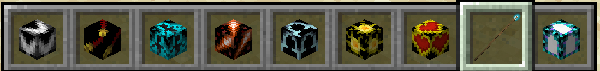
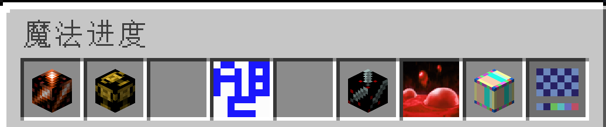

# 魔法系统

多数的法术都是通过法杖来发射的，法杖拿在手里时，左键发射当前法术。如果法杖上绑定有多个法术，可以通过右键来快速切换法术，或按 `Q` 键（丢弃键）来切换法术背包，在法术背包中你可以调整各个法术的顺序。如果你的法杖拥有不同等级的法术，按下 `F` 键（副手键）来翻页。如果你学会的法术已经超过了一个背包能容纳的数量，点击背包外部来翻页。

家园世界会刷新部分稀有魔法生物。

/// caption
法术背包
///

## 升级

合成或购买法杖后，你就可以通过附魔台来学习新法术，升级法杖。详见[法杖进度](progression.md)章节。

/// caption
使用附魔台升级法杖
///

## 消耗

法杖一般会消耗魔力值来释放法术。魔力池会自动恢复，法术背包打开时魔力池会在经验条中显示。经验等级为法术点 SP 或材料点 MP。

当然也会有一些法杖是消耗经验值或物品的，也有一些是不消耗任何东西的。同样也有一些法杖是用后即毁的。